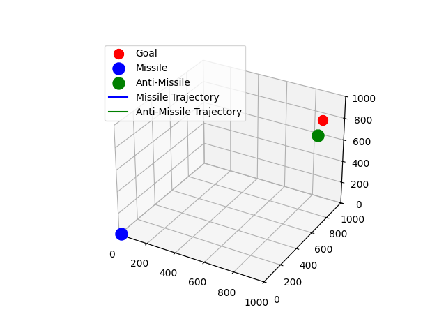

# Anti-Missile Missile Simulation



## About
In path planning, collision avoidance must be carefully balanced against the objective of reaching a designated goal. While many methods exist for path planning in both static and dynamic environments, these solutions become more difficult when the environment is assumed to be adversarial. In this project, we investigate decision-making methods for adversarial avoidance path planning in the context of an anti-missile avoidance game, where a missile aims to reach its target despite an active defense system seeking interception.

To address this question, we map the problem onto a missile/anti-missile game scenario in a controlled simulation environment. A missile navigates toward a specified target, and the environment contains an adversarial threat that can intercept it. We examine three decision-making approaches under uncertainty to avoid interception:

- **Monte Carlo Tree Search (MCTS):** A simulation-based search technique that iteratively builds a decision tree, balancing exploration and exploitation.
- **Partially Observable Markov Decision Process (POMDP):** A probabilistic framework designed to handle situations where the true state of the environment is not fully known.
- **Kalman Filtering-based Path Planning:** An approach using state estimation to track positions and guide the missile through noisy or incomplete information. By varying factors such as the start and target location, we can evaluate how each method performs in terms of collision avoidance and goal attainment.

## Installation

To install the package and its dependencies, follow these steps:

### Clone the Repository

```sh
git clone https://github.com/matte773/AntimissileSimulation.git
cd AntimissileSimulation
```

### (Optional) Creating a Virtual Environment (venv)
To create / recreate the virtual environment using your OS's Python, enter the following:

```sh
python -m venv .venv
```

Activate the new virtual environment

Windows: 
```sh
.\.venv\Scripts\Activate
```

Linux/Mac:
```sh
source .venv/bin/activate
```

Upgrade pip
```sh
python -m pip install --upgrade pip
```

### (Optional) Destroying the Virtual Environment (venv)
If the venv needs to be destroyed for any reason, use the following commands:

Deactivate the virtual environment if it's active:
```sh
deactivate
```

Remove the current virtual environment:
```sh
Remove-Item -Recurse -Force .venv
```

### Install the Package

Using `pip`, install the package in editable mode:

```sh
pip install -e .
```

## Running the Code

Once installed, you can run the anti-missile simulation using the `cli.py` script with different modes and options.

The package can be run with as many or as few flags as the user desires. Below are examples of individual flags/command parameters. Flags can be added to the command in any order is desired.

### Basic Usage

Run using Partially Observable Markov Decision Process (POMDP):
```sh
python -m antimissilesim --mode pomdp
```

Run using Monte Carlo Tree Search (MCTS):
```sh
python -m antimissilesim --mode mcts
```

Run the default simulation using Kalman filtering:
```sh
python -m antimissilesim --mode kalman
```

### Additional Flags

You can customize the simulation by providing additional command-line arguments:

- `--show_plots`: Enables plot animation (default is disabled).
  
  ```sh
  python -m antimissilesim --mode pomdp --show_plots
  ```

- `--num_simulations <int>`: Number of simulations to run (default: 100).
  
  ```sh
  python -m antimissilesim --num_simulations 500
  ```

- `--max_steps <int>`: Maximum number of steps per simulation (default: 1000).
  
  ```sh
  python -m antimissilesim --max_steps 2000
  ```

- `--missile_position <x y z>`: Initial missile position in 3D space. If this flag is left out, the initial position will be randomized (recommended to leave out).
  
  ```sh
  python -m antimissilesim --missile_position 0 0 100
  ```

- `--antimissile_position <x y z>`: Initial anti-missile position in 3D space. If this flag is left out, the initial position will be randomized (recommended to leave out).
  
  ```sh
  python -m antimissilesim --antimissile_position 10 10 200
  ```

- `--goal_position <x y z>`: Goal position for the missile. If this flag is left out, the initial position will be randomized (recommended to leave out).
  
  ```sh
  python -m antimissilesim --goal_position 50 50 0
  ```

- `--missile_velocity <float>`: Set missile velocity (default: 100).
  
  ```sh
  python -m antimissilesim --missile_velocity 150
  ```

- `--antimissile_velocity <float>`: Set anti-missile velocity (default: 105).
  
  ```sh
  python -m antimissilesim --antimissile_velocity 120
  ```

- `--weighting_factor <float>`: Adjusts evade weighting factor (default varies by mode: Kalman=0.5, MCTS=0.3, POMDP=0.8).
  
  ```sh
  python -m antimissilesim --weighting_factor 0.99
  ```

## Testing

The package includes a test suite to verify functionality. The testing file is located in `/test/example_test.py`. Run the tests using:

```sh
pytest
```

If warnings occur in the output, this is due to pytest having trouble interpreting one of my print outputs that needs UTF-8 encoding set. If this occurs, it is **not** an issue; the package is still functional. To fix this, run the following command for pytest instead:

```sh
python -X utf8 -m pytest
```

## POMDP Planner Details

The POMDP planner uses a probabilistic framework to handle situations where the true state of the environment is not fully known. It maintains a belief state, which is a probability distribution over possible states.

### Reward Function

The reward function balances the goal-seeking behavior and evasion strategy. It is defined as:

```python
reward = self.env.weight * goal_distance_change_norm + (1.0 - self.env.weight) * antimissile_distance_change_norm
```

Where:
- `goal_distance_change_norm` is the normalized change in distance to the goal.
- `antimissile_distance_change_norm` is the normalized change in distance to the anti-missile.

### Most-Likely Heuristic

The most-likely heuristic chooses the action that maximizes the immediate reward based on the most likely state estimate. It evaluates all possible actions and selects the one with the highest reward.

## Continuous Integration

This repository supports continuous integration (CI) via GitHub Actions. Every push and pull request triggers automated testing to ensure code integrity.

## Contributing

Contributions to improve the simulation and its decision-making algorithms are welcome. Feel free to fork the repository, make changes, and submit a pull request.

## License

This project is licensed under the BSD 3-Clause License. See the LICENSE file for details.